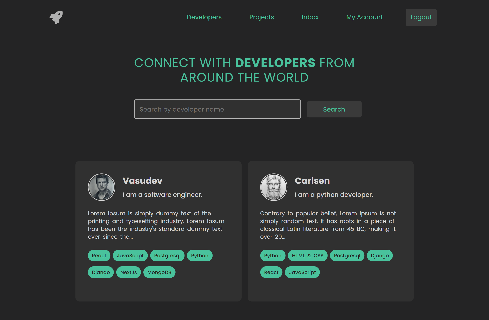
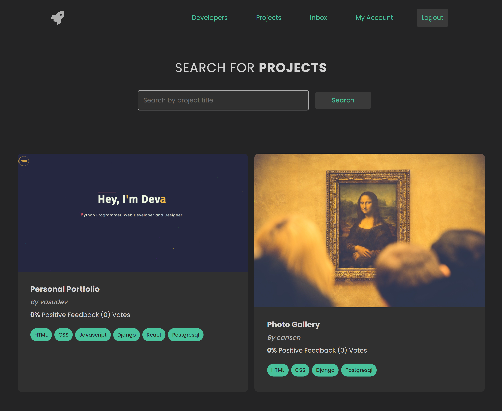
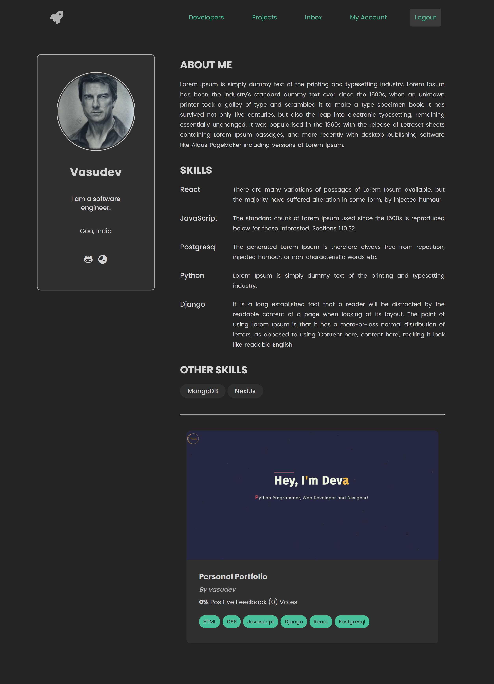
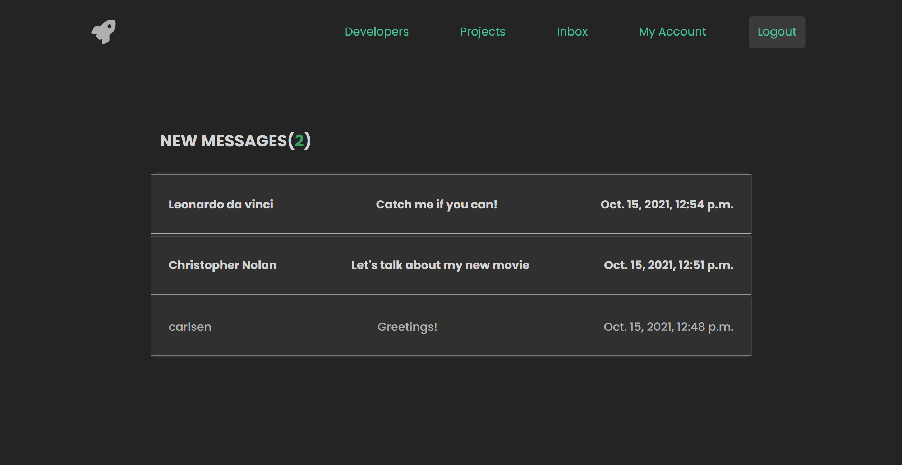

# WebDev(DevFinder)

A full-stack web app where developers from all over the world can create a profile and share their work with others.

# Installation

- 1 - clone repo https://github.com/Vasudevatirupathinaidu/WebDev
- 2 - create a virtual environment and activate
- - python -m venv env
- - env\Scripts\activate
- 3 - cd into project "cd webdev"
- 4 - pip install -r requirements.txt
- 5 - python manage.py runserver

# Features

- Share Projects
- Review and Voting system
- Search and Pagination
- Message other developers

# Tech Stack

- Javascript
- Django
- Postgres
- Django REST Framework

# Home Page

# Projects Page

# Profile Page

# User Inbox

